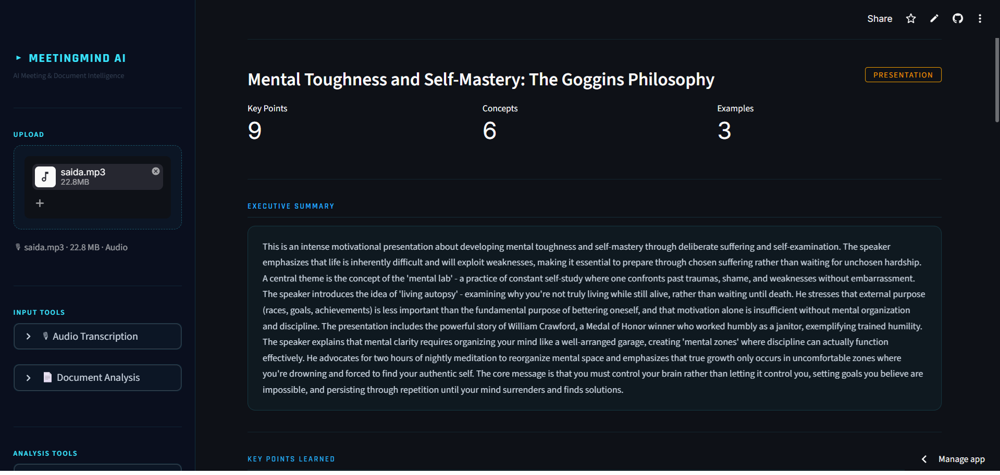
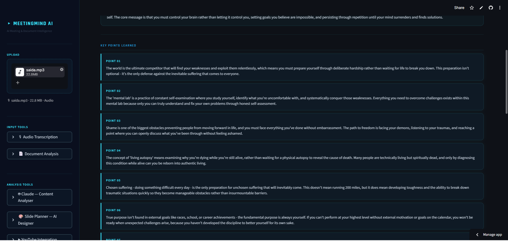
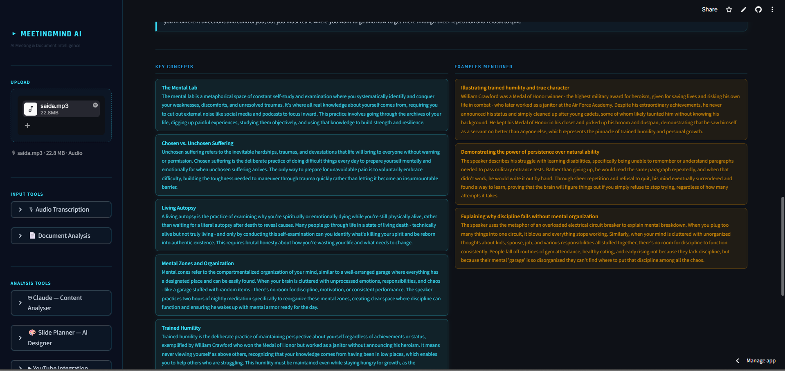
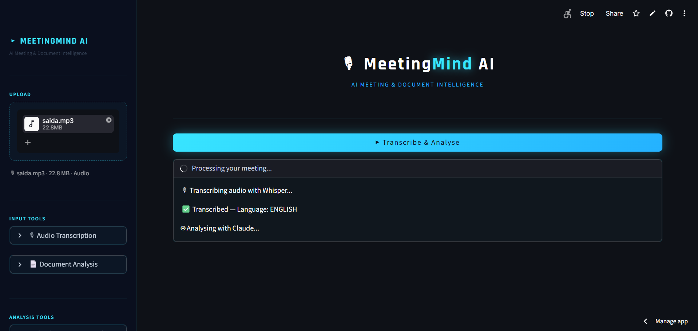
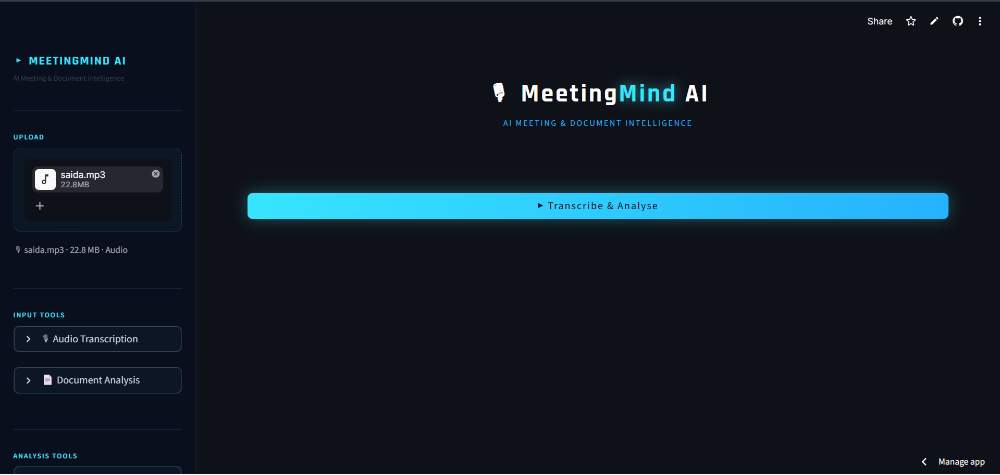
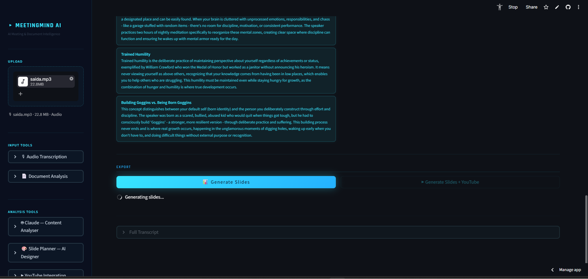
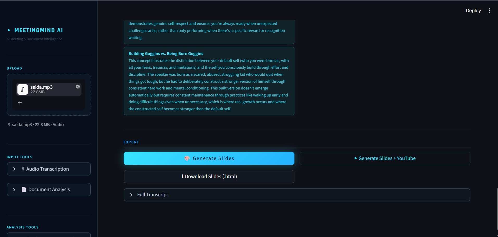
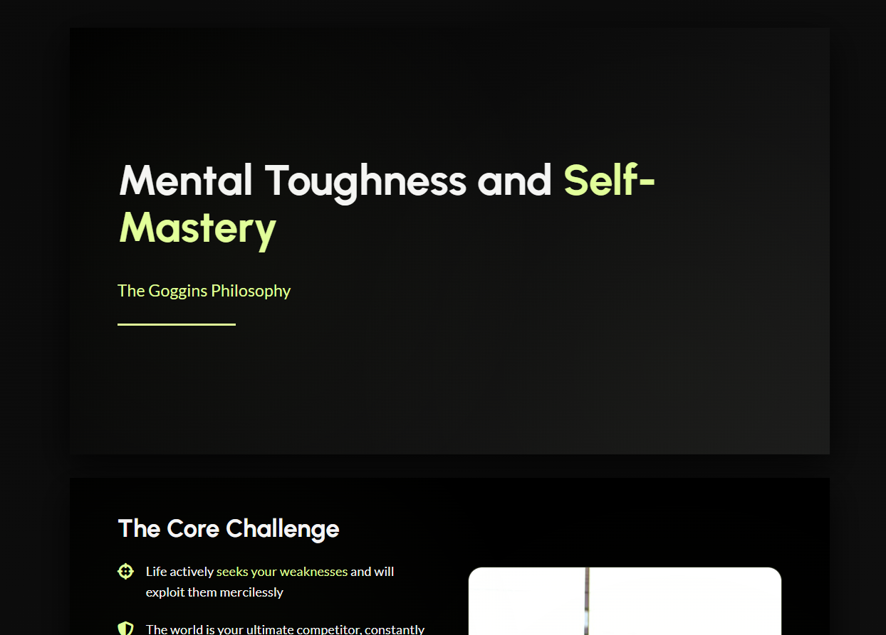
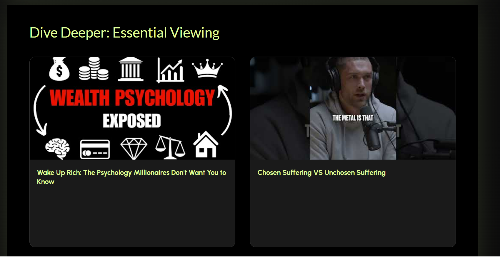

# 🎙 MeetingMind AI

> Transform any audio recording or document into structured intelligence — transcription, key insights, and McKinsey-style slide decks in minutes.

**[🚀 Live Demo](https://ai-meetingmind.streamlit.app)** · Built with Whisper · Claude · LangChain · Streamlit

---

## Overview

MeetingMind AI is a full-stack AI application that ingests audio recordings or documents and produces structured insights — executive summaries, key points, concepts, examples, and exportable HTML slide decks styled after elite consulting presentations.

It auto-detects content type (Meeting, Class, Webinar, Presentation, Document) and adapts the analysis accordingly.

---

## Screenshots

### 1 — Analysis Dashboard
Structured insights with metrics, executive summary, and detailed key points extracted from a 22MB audio recording.



### 2 — Key Points Learned
Each key point rendered as a glassmorphic card with detailed explanation — numbered, organised, actionable.



### 3 — Key Concepts & Examples
Side-by-side layout of core concepts and real-world examples extracted from the content.



### 4 — Processing Pipeline
Real-time status updates as the app transcribes with Whisper API and analyses with Claude.



### 5 — Upload & Analyse
Clean upload interface with automatic file type detection — audio routes to Whisper, documents route directly to Claude.



### 6 — Generating Slides
One-click HTML slide generation with optional YouTube video integration.



### 7 — HTML Slide Deck
Download button appears immediately after generation — no page reload required.


### 8 — Slides Ready



### 9 — YouTube Version
Dedicated "Dive Deeper" slide with real YouTube thumbnails and clickable links fetched via YouTube Data API v3.



---

## Features

**Input**
- Audio transcription via OpenAI Whisper API (MP3, MP4, WAV, M4A, WEBM, OGG — up to 25MB)
- Document analysis for PDF, TXT, DOCX, PPTX — text extracted locally, analysed by Claude

**Analysis**
- Auto-detects content type: Meeting / Class / Webinar / Presentation / Document / Report
- Extracts: executive summary, key points, key concepts, examples, action items, decisions, open questions
- Always responds in the same language as the input

**Export**
- McKinsey/BCG-style HTML slide deck — single file, opens in any browser, works on mobile
- Optional YouTube slide with 2 real video thumbnails fetched via YouTube Data API v3
- Real Unsplash photos embedded via API — no invented URLs

**UI**
- Glassmorphic dark theme — navy, neon cyan, IBM-inspired typography
- Informative sidebar with expandable tool descriptions, cost, and model details
- Deployed on Streamlit Cloud — publicly accessible

---

## Tech Stack

| Layer | Technology |
|---|---|
| Transcription | OpenAI Whisper API (`whisper-1`) |
| Analysis | Claude `claude-sonnet-4-5` via LangChain |
| Slide Generation | Claude `claude-sonnet-4-5` via Anthropic SDK |
| Image Search | Unsplash API |
| Video Search | YouTube Data API v3 |
| Document Parsing | PyMuPDF · python-docx · python-pptx |
| UI | Streamlit |
| Framework | LangChain + LangChain-Anthropic |
| Output Schema | Pydantic v2 |
| Deployment | Streamlit Cloud |

---

## Project Structure

```
app.py                          # Entry point — orchestrates all pipelines
src/
  core/
    transcriber.py              # Whisper API transcription
    analyser.py                 # Claude structured extraction (transcript + document)
    document_reader.py          # PDF, TXT, DOCX, PPTX text extraction
    slide_planner.py            # Claude slide planning with design rules
  ui/
    sidebar.py                  # Informative sidebar with tool descriptions
    results.py                  # Insights display + export buttons
    styles.py                   # Glassmorphic CSS design system
  utils/
    session.py                  # Centralised session state
    html_generator.py           # McKinsey/BCG HTML slide generation
    youtube_search.py           # YouTube Data API v3 integration
    slides_generator.py         # PPTX generator (legacy)
```

---

## Quickstart

```bash
git clone https://github.com/marcosotaviox/ai-meeting-assistant
cd ai-meeting-assistant

python -m venv .venv
source .venv/bin/activate        # Windows: .venv\Scripts\Activate.ps1

pip install -r requirements.txt

cp .env.example .env             # Fill in your API keys
streamlit run app.py
```

### Required API Keys

```env
ANTHROPIC_API_KEY=sk-ant-...
OPENAI_API_KEY=sk-proj-...
UNSPLASH_ACCESS_KEY=...
YOUTUBE_API_KEY=...
```

---

## Design Decisions

**`PydanticOutputParser`** — enforces typed JSON output from Claude. No regex, fails loudly if the model drifts.

**Separate `analyse_transcript()` and `analyse_document()`** — different system prompts optimised for each content type. Transcripts assume spoken language patterns; documents assume structured written content.

**HTML over PPTX for slides** — Claude generates a complete HTML file in one call. No dependency on `python-pptx` rendering quirks, works on any device, visually superior.

**Real Unsplash URLs** — images are fetched via API before the Claude call and passed as explicit URLs in the prompt. Claude never invents image URLs.

**`slide_planner.py` as a separate step** — Claude first plans the presentation (layouts, bullets, image queries) then a separate renderer builds the output. Separation of concerns — planning and rendering are independent.

---

## Running Tests

```bash
pytest tests/ -v
```

---

*Built by Marcos*
